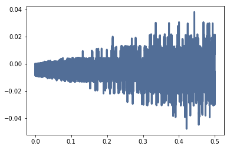
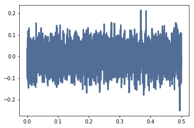
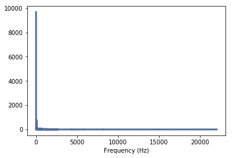
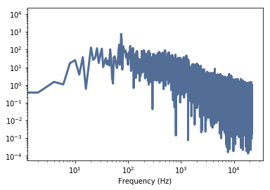
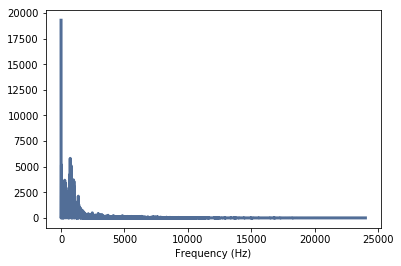
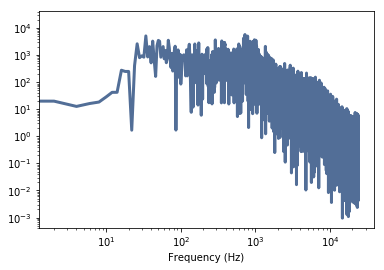
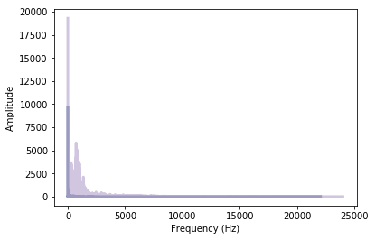
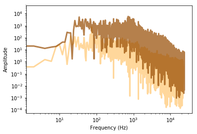

Exercise 4.1 “A Soft Murmur” is a web site that plays a mixture of natural
noise sources, including rain, waves, wind, etc. At http://asoftmurmur.
com/about/ you can find their list of recordings, most of which are at http:
//freesound.org.
Download a few of these files and compute the spectrum of each signal.
Does the power spectrum look like white noise, pink noise, or Brownian
noise? How does the spectrum vary over time?


```python
from __future__ import print_function, division

%matplotlib inline
import warnings
warnings.filterwarnings('ignore')

import thinkdsp
import thinkplot
import thinkstats2 

import numpy as np

from ipywidgets import interact, interactive, fixed
import ipywidgets as widgets
```

두 wav 파일 읽기


```python
wave1 = thinkdsp.read_wave('13793__soarer__north-sea.wav')
wave2 = thinkdsp.read_wave('105272__inchadney__strong-wind-in-the-forest.wav')
```

세그먼트로 쪼개기


```python
seg1 = wave1.segment(start=0, duration=0.5)
seg2 = wave2.segment(start=0, duration=0.5)
```

Wave의 모양 - Noise


```python
seg1.plot()
```





```python
seg2.plot()
```





Linear Scale의 wave1 스펙트럼 그리기


```python
spec1 = seg1.make_spectrum()
spec1.plot_power()
thinkplot.config(xlabel='Frequency (Hz)')
```





wave1의 스펙트럼을 Log-log scale로 나타내기


```python
spec1.plot_power()
thinkplot.config(xlabel='Frequency (Hz)',xscale='log',yscale='log')
```





Linear Scale의 wave2 스펙트럼 그리기


```python
spec2 = seg2.make_spectrum()
spec2.plot_power()
thinkplot.config(xlabel='Frequency (Hz)')
```





wave2의 스펙트럼을 Log-log scale로 나타내기


```python
spec2.plot_power()
thinkplot.config(xlabel='Frequency (Hz)',xscale='log',yscale='log')
```





LInear Scale의 두 스펙트럼 형태 비교


```python
spec1.plot_power()
spec2.plot_power(color='#beaed4')
thinkplot.config(xlabel='Frequency (Hz)',
                 ylabel='Amplitude')
```





Log-log Scale의 두 스펙트럼 형태 비교


```python
spec1.plot_power(color='#ffc671') # White에 가까운 Pink 노이즈
spec2.plot_power(color='#964b00') # Brownian에 가까운 Pink 노이즈
thinkplot.config(xlabel='Frequency (Hz)',
                 ylabel='Amplitude',
                 xscale='log', 
                 yscale='log')
```





두 log scale 스펙트럼의 slope 계산 


```python
result1 = spec1.estimate_slope()
result1.slope
```


    -1.1265673670475325


spec1의 파워 스펙트럼의 slope, Beta 값은 -1.1이다.
Power = 1/f^(-1.1) 이므로 White Noise에 가까운 Pink Noise이다.


```python
result2 = spec2.estimate_slope()
result2.slope
```


    -1.8160145956563436


spec2의 파워 스펙트럼의 slope, Beta 값은 -1.8이다.
Power = 1/f^(-1.8) 이므로 Brownian Noise(Red Noise)에 가까운 Pink Noise이다.
